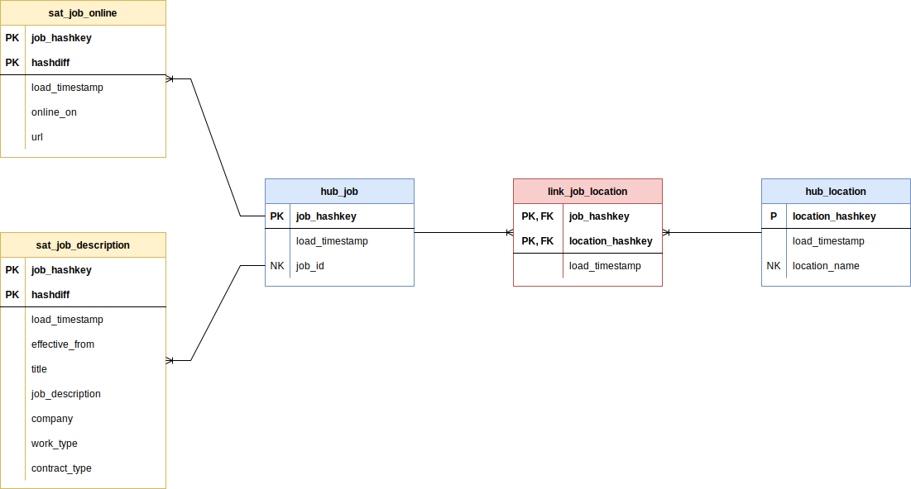

# Job Market Analytics

The aim of this project is to develop an end-to-end Data Platform to explore and learn new technologies.

## Architecture

## Storage

### Data Lake

The Data Lake is basically a file system on my local computer, but could be easily transfered to a Cloud Blob Storage (
like AWS S3 or Azure Blob Storage) if needed. The current Data Lake we have two layers:

- The **Raw Layer**, where the information from the data source are stored in the same file format as ingested (e.g.
  HTML or XML).
- The **Cleansed Layer**, where we store the information in Parquet, which means that the information is stored in a
  tabular format with well-defined columns.

### Data Warehouse

The Data Warehouse is based on PostgreSQL plus an extension in order to read Parquet files as foreign tables. PostgreSQL
might not be the best choice for a datawarehouse since it is row-column-oriented but in this case we have reduced number
of columns and a relative small data size. Another advantage of PostgreSQL is that I can run it easily on my computer
via Docker so that I can avoid cloud service costs. We will divide the datawarehouse in 3 schemas:

- **Staging**, which are basically foreign tables referencing the Parquet files on the Data Lake Cleansed Layer.
- **Data Vault**, where the data is modelled and historized using
  the [Data Vault Specification](https://danlinstedt.com/wp-content/uploads/2018/06/DVModelingSpecs2-0-1.pdf).
- **Data Mart**, which will be the consuming layer for our BI Tool.

### Data Vault Model

## Computing

In order to compute the data, we use two different approaches.

- **Python** for the data ingestion, when we crawl and scrape data directly from the data source. And also for the data
  transformation from the Raw to the Cleansed layer. All Python code is divided in atomic tasks and these will be
  automated by [Airflow](https://airflow.apache.org/).
- **SQL** for the transformations of the data inside the Data Warehouse. The SQL tasks are automated and orchestrated
  by [dbt](https://www.getdbt.com/).

## Frequently Asked Questions

### What questions can be answered with this project?

Here are some examples of what we can answer:

- How is a job offer online until it is taken offline?
- Which technologies are the most demanded at the momment?
- How the demand for a particular technology evolves during the time?
- How many jobs offer remote jobs and how this is evolving during the time?
- When was a particular job offer first published?

### Could we answer those questions with a simplier technology stack?

Yes, we could. But the point of the project is to explore and learn new technologies and concepts, therefore it has been
over-engineered on purpose.

### Are you planning to create a public Web or Mobile Application with this?

No, at least not at the moment. This is just for educative purposes.

### Why did you choose Parquet as file format for the Cleansed Layer in the Data Lake?

I choose Parquet because it is a column-oriented compressed file type, which has been well-batled-tested. Good Python
libraries are available like [Pyarrow](https://arrow.apache.org/docs/python/parquet.html) to write and read.

### Why did you choose PostgresSQL for the Data Warehouse?

PostgreSQL is a very robust database with standard SQL that can run locally and its performance is good enough for the
current data size and number of columns.

### How big is your data?

It is around 43 GB in raw format after the initial load and being scraping the web source for 6 weeks, and it grows
around 2 GB every day. After cleansing and compressing the data to Parquet is around 30 times smaller, since we can get
rid of a great deal of HTML, CSS and JS because it does not provide any extra information for my use cases.
